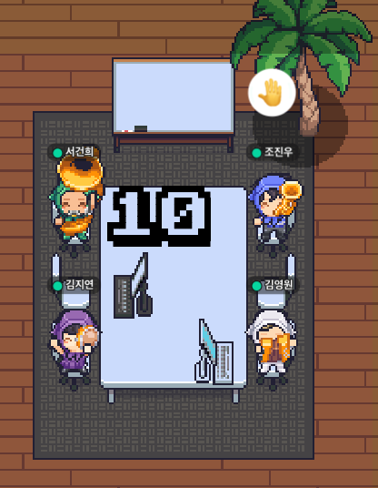

안녕하세요, 5년차 백엔드 개발자 조진우입니다. 항해 플러스 백엔드 과정에 참여한 이유는 매주 주어지는 과제를 통해 더욱 성장하고, 다양한 사람들과의 교류를 통해 시각을 넓히고 싶었기 때문입니다. 이번 주차를 마무리하며, 제 경험과 배운 점들을 공유하고자 합니다.

아래는 이번 챕터를 함께한 멋진 조원들입니다 ㅎㅎ
팀원들이 있어서 지금까지 무리 없이 올 수 있었다는 생각이 듭니다. 
우리 10조 마지막까지 화이팅!

## 이번 챕터의 주요 목표

이번 챕터에서는 두 가지 주요 목표를 설정했습니다. 첫째, 대기열 구현에 성공하는 것이었고, 둘째, CI/CD를 완벽하게 구현하는 것이었습니다. 이 두 가지 목표를 통해 실무에 가까운 프로젝트 경험을 쌓고, 백엔드 개발자로서의 역량을 한층 강화하고자 했습니다.

## 기억에 남는 성취

이번 챕터에서 가장 기억에 남는 성취는 **낙관적 락(Optimistic Lock)과 비관적 락(Pessimistic Lock)을 활용한 동시성 처리**입니다. 이 두 가지 락 전략을 통해 데이터 무결성을 유지하면서도 시스템의 성능을 최적화할 수 있었습니다. 낙관적 락을 통해 트랜잭션 충돌을 최소화하며 효율적으로 동시 처리를 수행했고, 비관적 락을 통해 충돌 가능성이 높은 상황에서는 사전에 락을 걸어 문제를 방지했습니다.

또한, **Logback의 Slack Appender를 활용하여 로그 알림을 실시간으로 슬랙으로 전송할 수 있는 기능을 구현한 점**도 큰 성취였습니다. 이를 통해 로그 관리와 모니터링의 효율성을 크게 향상시킬 수 있었고, 실시간으로 시스템 상태를 파악하고 대응할 수 있는 유용한 도구를 갖추게 되었습니다.

## 이루지 못한 목표

CI/CD 부분에서는 아쉽게도 약간의 부족함을 느꼈습니다. 초기 설정과 기본적인 파이프라인 구축은 성공했지만, 자동화된 테스트와 배포 프로세스를 완벽하게 구현하는 데는 미흡한 점이 있었습니다. 특히, 복잡한 배포 시나리오에서의 에러 핸들링과 롤백 전략에 대한 깊은 이해와 경험이 부족하다는 것을 깨달았습니다.

## 다음 챕터의 목표

다음 챕터에서는 Redis와 Kafka를 활용하여 분산 락을 구현하는 것을 목표로 하고 있습니다. Redis를 이용해 여러 서버에서 동시에 접근할 때 데이터의 일관성을 유지하고 동시성 문제를 해결하려고 합니다. Kafka를 통해서는 이벤트 처리와 메시지 큐를 활용하여 시스템의 안정성을 높이는 방법을 시도해 볼 계획입니다. 이 두 가지 기술을 실제 프로젝트에 적용하며 그 활용 방법과 장단점을 배우고자 합니다.

## 강화해야 할 강점

제가 강화해야 할 가장 중요한 강점은 '꾸준함'입니다. 무엇이든 꾸준히 파고드는 성향은 저의 큰 장점입니다. 새로운 기술이나 개념을 깊이 있게 탐구하고 끝까지 완성하려는 꾸준한 노력이 저를 지금의 자리까지 이끌어 주었다고 생각합니다. 앞으로도 이 꾸준함을 유지하며 더욱 성장하고자 합니다.

## 개선해야 할 점

제가 개선해야 할 가장 중요한 점은 하나에 몰두하다가 다른 중요한 것들을 놓치는 경향이 있다는 것입니다. 어떤 문제에 깊이 파고드는 것은 좋지만, 그로 인해 다른 중요한 작업들을 소홀히 할 때가 있습니다. 이를 개선하기 위해 전체적인 시야를 넓히고, 우선순위를 잘 조절하는 연습이 필요할 것입니다.

이번 챕터를 통해 많은 것을 배웠고, 앞으로 남은 챕터들의 새로운 도전과 배움을 통해 한 단계 더 성장할 수 있도록 최선을 다하겠습니다. 감사합니다.