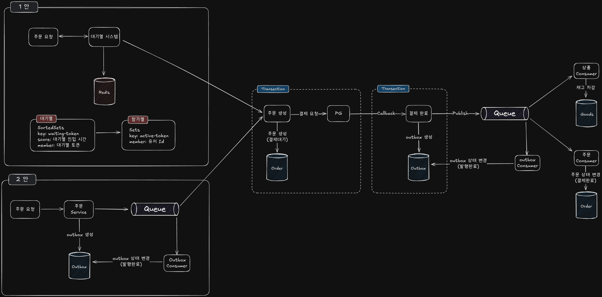

---

## 1. 문서 개요

이 문서는 **대량 주문 트래픽 상황에서 서버 안정성과 사용자 경험을 모두 만족시키는 설계 방안**을 설명합니다.  
  
주요 목표:  
- 주문 요청 실패 없이 높은 트래픽을 처리하려면 어떤 구조가 적절한가?
- 사용자 순서를 보장하면서 실시간 처리가 가능한 구조는 무엇인가?
- MVP 수준으로 빠르게 적용 가능한 설계 방식은?

---

## 2. 문제 정의

특정 시점(이벤트 오픈, 한정 수량 상품 등)에 대량 주문 요청이 발생하면 다음 문제가 나타납니다:
- 서버 과부하
- 재고 초과 주문
- 사용자 요청 실패 및 이탈

➡️ 이를 해결하려면 **대기열 기반 설계 구조**가 필요합니다.

---

## 3. 요구 사항 정리

- 주문 종류
	- 일반 상품 주문
	- 트래픽이 몰리는 한정 상품 주문

- 실시간성 여부
	- 주문 요청 자체는 실시간 필요
	- 주문 생성 및 결제는 지연 가능

- 장애 대응
	- 주문 실패 시 재시도 고려
	- 메시지 유실 방지 필요

---

## 4. 설계안 비교 요약


### ✅ 1안: Redis 기반 대기열 제어

- Redis SortedSet에 사용자 등록
- 순차 입장 후 Redis Set 등록 → 주문 생성
- 주문/결제는 Outbox + Queue로 비동기 처리

### ✅ 2안: Queue 직접 진입 방식

- 주문 요청 즉시 Queue 등록
- Consumer가 주문 생성
- 주문/결제는 Outbox + Queue로 비동기 처리

---

## 5. 설계안 동작 흐름 및 구성 요소

### 1안: Redis 기반 대기열 시스템

#### 💡 목적

- 사용자 순서 보장
- 트래픽 제어로 서버 안정성 확보

#### 🧱 구성 요소

|구성 요소|설명|
|---|---|
|Redis SortedSet|대기 사용자 목록 및 순서 관리|
|Redis Set|참가열 사용자 관리|
|Batch 프로세스|주기별 입장 사용자 선정|
|주문 서비스|입장 완료 시 주문 처리 요청|

#### 🔁 사용자 진입 흐름


🧮 ETA 계산 예시
```java
ETA = (대기번호 / 입장 인원) * 주기 시간
```

예상 계산:
- TPS = 1000
- 사용자당 평군 요청 횟수 = 3회
- → 분당 처리 가능 사용자 수 = (1000 × 60) / 3 = 20,000명
- → 10초 단위 입장 가능 인원 = 약 3,333명

#### 🔁 참가열 전환 흐름


#### ✅ 장점

- 사용자 순서 및 ETA 제공
- 서버 과부하 방지

#### ❌ 단점

- Redis 상태 관리 복잡
- 대기 시간 존재
- 구현 난이도 높음 (Batch, 중복 방지 등)

---

### 2안: Queue 직접 진입

#### 💡 목적

- 구조 단순화
- 빠른 구현과 실시간 응답

#### 🧱 구성 요소

| 구성 요소           | 설명           |
| --------------- | ------------ |
| Outbox 테이블      | 주문 요청 영속화    |
| 비동기 Queue       | 메시지 전달       |
| Consumer        | 주문 생성/결제 처리  |
| Outbox Consumer | 메시지 발행 상태 관리 |

#### 🔁 Queue 진입 흐름


#### 🔁 오류 및 재시도 흐름

아래는 Queue 발행이 실패했을 경우의 복구 및 재시도 흐름입니다.  
**Outbox 기반 구조를 통해 메시지 유실을 방지하며, 실패 시 재시도 또는 DLQ(Dead Letter Queue)로 분기**됩니다.


#### ✅ 장점

- 구조 단순, 빠른 구현
- 실시간 응답 가능
- MVP나 일반 주문에 적합

#### ❌ 단점

- 사용자 순서 제어 어려움
- Queue 적체 시 대응 어려움
- ETA 제공 불가

---

## 6. 설계 비교

| 항목       | 1안: Redis 대기열           | 2안: Queue 직행 |
| -------- | ----------------------- | ------------ |
| 트래픽 제어   | ✅ 가능                    | ❌ 어려움        |
| 구조 복잡도   | 복잡 (Batch, Redis 상태 관리) | 단순           |
| 유저 순서 보장 | ✅                       | ❌            |
| 응답 속도    | 느림 (ETA 계산 후 응답)        | 빠름           |
| 확장성      | Redis + Queue 확장 필요     | Queue 중심 확장  |

---

## 7. 어떤 상황에서 어떤 설계를 선택해야 하는가?

| 상황                      | 권장 설계안           |
| ----------------------- | ---------------- |
| 이벤트, 한정 수량 등 트래픽 폭주 예상  | ✅ 1안 (Redis 대기열) |
| 일반 상품, 단순 주문 처리         | ✅ 2안 (Queue 직행)  |
| 사용자 순서 보장이 중요함          | ✅ 1안             |
| 빠른 MVP 구축 필요            | ✅ 2안             |
| ETA 제공을 통한 사용자 경험 향상 목표 | ✅ 1안             |

---

## 8. 결론

두 설계안 모두 장단점이 있으며, 서비스 목적과 운영 환경에 따라 선택이 달라집니다.  
- **Redis 대기열 방식**은 사용자의 순서, 트래픽 제어, 예측 가능한 UX가 중요할 때 적합합니다.
- **Queue 직접 진입 방식**은 실시간 처리와 빠른 구현이 필요할 때 효과적입니다.

> 💡 두 방식을 혼합 적용하거나, 단계적으로 전환하는 것도 고려할 수 있겠습니다.

---
